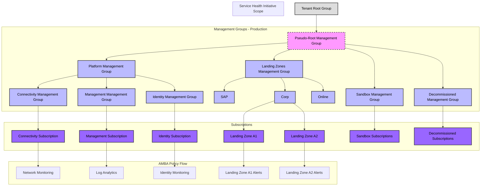
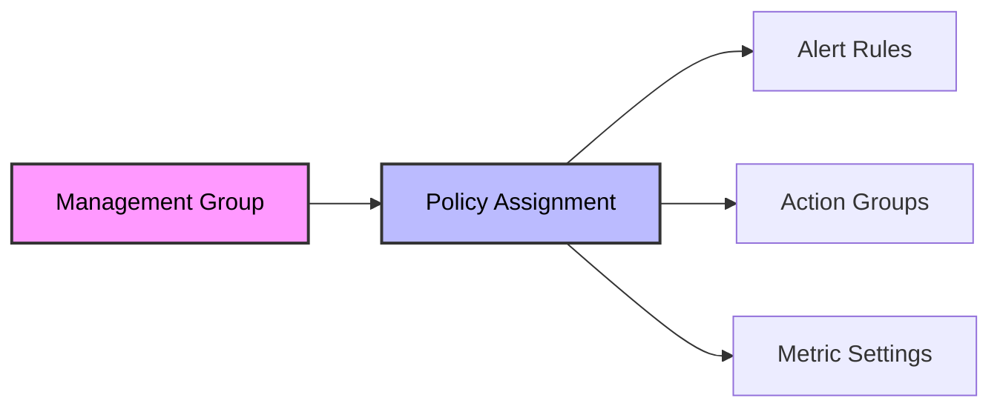
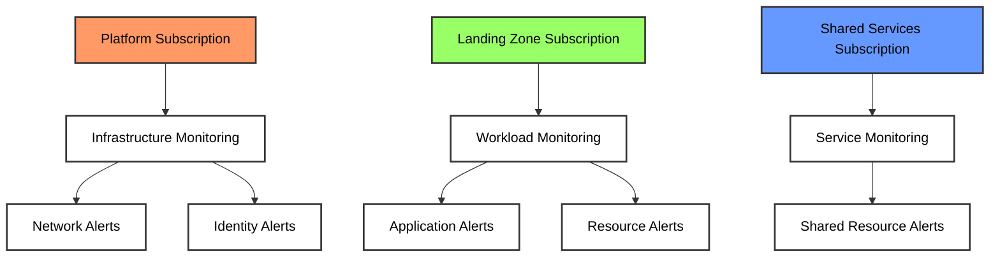
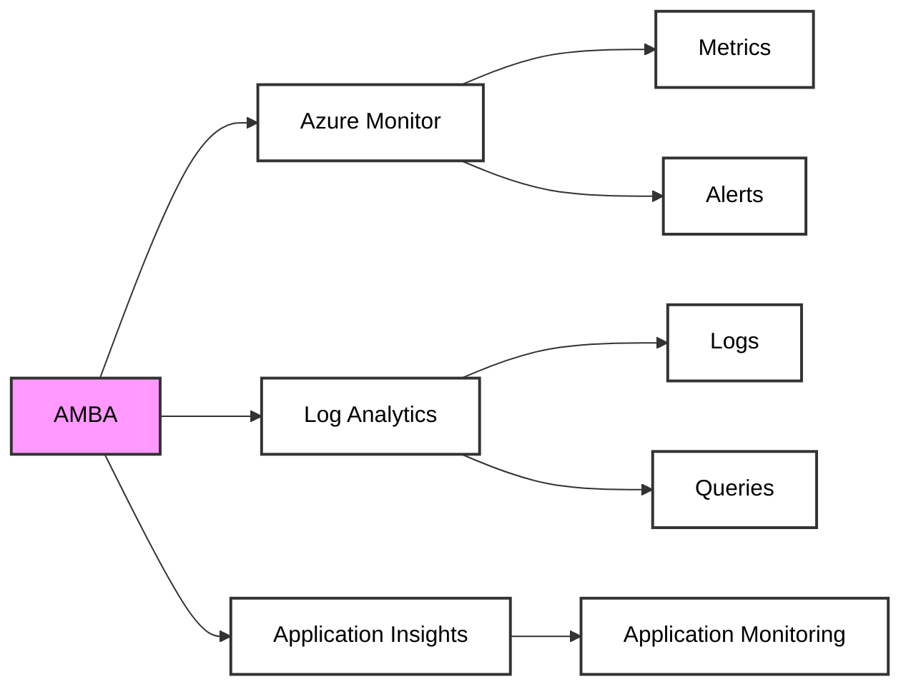
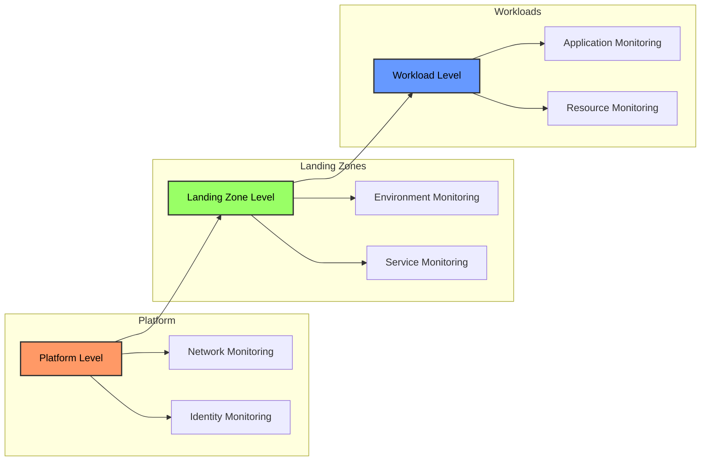

# ALZ Integration

AMBA's integration with Azure Landing Zone (ALZ) environments provides a robust foundation for standardized monitoring across your Azure estate. This section explores how AMBA enhances ALZ's monitoring capabilities and helps maintain consistent monitoring practices across your landing zone architecture.

For a comprehensive overview of Azure Landing Zones, see the [official ALZ documentation](https://learn.microsoft.com/en-us/azure/cloud-adoption-framework/ready/landing-zone/).

## Understanding ALZ Integration

AMBA's integration with ALZ environments is designed to complement and enhance the monitoring capabilities provided by the landing zone architecture. The framework aligns with ALZ's management group hierarchy and subscription organization, ensuring that monitoring configurations are applied consistently across your environment.

### Pseudo-Root Management Group

The pseudo-root management group is a critical concept in AMBA deployment. This is typically the highest-level management group in your hierarchy where you want AMBA policies to take effect. It requires specific considerations:

1. **Deployment Identity Requirements**:
   - The deployment identity needs `Owner` permissions at this level
   - This permission is necessary for creating role-based access control assignments
   - Required for deploying policy definitions and assignments

2. **Service Health Initiative Assignment**:
   - The Service Health Initiative is assigned at this level
   - This ensures organization-wide health monitoring coverage
   - Controls the deployment of alert processing rules and action groups
   - Manages service health alerts across all subscriptions

3. **Policy Flow**:
   - Policies and initiatives flow down from this level
   - Affects all child management groups and subscriptions
   - Enables consistent monitoring across the organization
   - Supports inheritance and override patterns

4. **Deployment Considerations**:
   ```json
   {
     "deploymentScope": {
       "pseudoRootManagementGroup": {
         "id": "/providers/Microsoft.Management/managementGroups/contoso",
         "displayName": "Contoso",
         "permissions": ["Owner"],
         "initiatives": ["Service Health"]
       }
     }
   }
   ```

### Management Group Hierarchy

The following diagram illustrates how AMBA integrates with the management group hierarchy, highlighting the pseudo-root management group's role:



### Key Implementation Notes

1. **Permissions and Access**:
   - The deployment identity must have `Owner` role at the pseudo-root level
   - This enables policy assignment and RBAC management
   - Required for creating and managing alert rules
   - Needed for action group deployment

2. **Service Health Configuration**:
   ```json
   {
     "serviceHealth": {
       "scope": "/providers/Microsoft.Management/managementGroups/contoso",
       "initiatives": {
         "name": "Service-Health-Initiative",
         "displayName": "Monitor Service Health",
         "category": "Monitoring",
         "enforcement": "DoNotEnforce"
       }
     }
   }
   ```

3. **Alert Processing Rules**:
   - Deployed at the pseudo-root level
   - Apply to all child resources
   - Control alert suppression and routing
   - Manage notification configuration

## Core Integration Components

### Management Group Alignment

AMBA's policy initiatives are designed to align with [ALZ's management group hierarchy](https://learn.microsoft.com/en-us/azure/cloud-adoption-framework/ready/landing-zone/design-area/management-group-hierarchy), ensuring that monitoring configurations are applied at the appropriate levels.



### Subscription Organization

AMBA's monitoring configurations work seamlessly with [ALZ's subscription organization model](https://learn.microsoft.com/en-us/azure/cloud-adoption-framework/ready/landing-zone/design-area/subscription-democratization). The framework applies monitoring based on subscription roles:



### Resource Coverage

AMBA provides specialized monitoring for common ALZ resources:

- [Azure Firewall](https://learn.microsoft.com/en-us/azure/firewall/overview)
- [Azure Front Door](https://learn.microsoft.com/en-us/azure/frontdoor/overview)
- [Azure Key Vault](https://learn.microsoft.com/en-us/azure/key-vault/general/overview)
- [Azure Virtual Network](https://learn.microsoft.com/en-us/azure/virtual-network/virtual-networks-overview)

## Implementation Considerations

### Environment-Specific Configuration

AMBA supports environment-specific monitoring through [Azure Policy parameters](https://learn.microsoft.com/en-us/azure/governance/policy/concepts/parameters):

```json
{
  "parameters": {
    "environmentType": {
      "type": "String",
      "metadata": {
        "displayName": "Environment Type",
        "description": "Environment type for alert thresholds"
      },
      "allowedValues": [
        "Production",
        "Development",
        "Testing"
      ]
    }
  }
}
```

### Integration with ALZ Services

AMBA integrates with key Azure services:

- [Azure Monitor](https://learn.microsoft.com/en-us/azure/azure-monitor/overview)
- [Log Analytics](https://learn.microsoft.com/en-us/azure/azure-monitor/logs/data-platform-logs)
- [Application Insights](https://learn.microsoft.com/en-us/azure/azure-monitor/app/app-insights-overview)



## Best Practices

### Monitoring Strategy

When implementing AMBA in an ALZ environment, follow these best practices:

1. Align with [Azure Well-Architected Framework](https://learn.microsoft.com/en-us/azure/well-architected/)
2. Follow [Azure Monitor best practices](https://learn.microsoft.com/en-us/azure/azure-monitor/best-practices-plan)
3. Implement [secure baseline policies](https://learn.microsoft.com/en-us/security/benchmark/azure/security-controls-v3-monitoring)

### Implementation Approach

Follow this structured approach:



## Next Steps

Ready to deploy AMBA in your ALZ environment? Continue to our [Deployment Process](04-Deployment-Process.md) section to learn about the step-by-step implementation process.

For more information about Azure Landing Zones, visit:
- [ALZ Overview](https://learn.microsoft.com/en-us/azure/cloud-adoption-framework/ready/landing-zone/)
- [ALZ Architecture](https://learn.microsoft.com/en-us/azure/cloud-adoption-framework/ready/landing-zone/landing-zone-architecture)
- [ALZ Design Principles](https://learn.microsoft.com/en-us/azure/cloud-adoption-framework/ready/landing-zone/design-principles)

[Back to Main Document](../README.md) | [Previous: Technical Strategy](02-Technical-Strategy.md) | [Next: Deployment Process](04-Deployment-Process.md) 