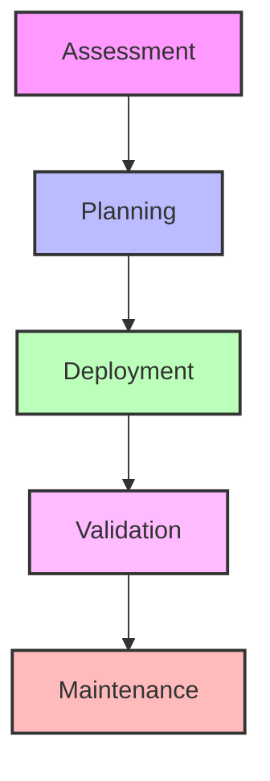
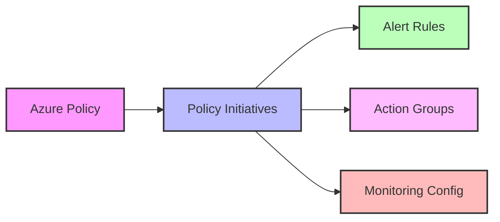

# Azure Monitor Baseline Alerts (AMBA) Overview

## Introduction
Azure Monitor Baseline Alerts (AMBA) provides a standardized monitoring framework for Azure environments. This summary documentation covers essential aspects of AMBA implementation and management.

## Key Components

### 1. Core Monitoring Framework
- **Policy-Based Implementation**: Automated deployment through Azure Policy
- **Standardized Alerts**: Pre-configured baseline alerts for common scenarios
- **Flexible Architecture**: Adaptable to different environment sizes and needs

### 2. Main Features
| Feature | Description |
|---------|-------------|
| Baseline Alerts | Pre-configured alerts for critical services |
| Policy Initiatives | Structured monitoring policy sets |
| Integration Options | ALZ compatibility and custom deployment paths |
| Management Tools | Monitoring and maintenance utilities |

### 3. Implementation Approach

## Quick Start Guide

### Prerequisites
1. Azure subscription with appropriate permissions
2. Resource providers registered:
   - Microsoft.Insights
   - Microsoft.AlertsManagement
   - Microsoft.OperationalInsights

### Basic Setup Steps
1. **Environment Assessment**
   - Inventory current monitoring
   - Identify monitoring gaps
   - Document requirements

2. **Initial Configuration**
   - Configure Log Analytics workspace
   - Set up action groups
   - Deploy core policy initiatives

3. **Validation**
   - Test alert configurations
   - Verify monitoring coverage
   - Validate notifications

## Architecture Overview

### Core Components

### Integration Points
- Azure Landing Zone (ALZ) compatibility
- Azure Monitor integration
- Log Analytics workspace connection
- Custom monitoring solutions

## Documentation Structure

1. **[Technical Implementation](02-Technical-Implementation.md)**
   - Deployment process
   - ALZ integration
   - Policy configuration

2. **[Monitoring Configuration](03-Monitoring-Configuration.md)**
   - Alert setup
   - Metric configuration
   - Log Analytics setup

3. **[Management & Operations](04-Management-Operations.md)**
   - Maintenance tasks
   - Troubleshooting
   - Best practices

4. **[Advanced Topics](05-Advanced-Topics.md)**
   - Custom initiatives
   - Advanced configurations
   - Integration patterns

## Additional Resources

### Official Documentation
- [Azure Monitor Documentation](https://learn.microsoft.com/en-us/azure/azure-monitor/)
- [Azure Policy Documentation](https://learn.microsoft.com/en-us/azure/governance/policy/)
- [AMBA GitHub Repository](https://github.com/Azure/azure-monitor-baseline-alerts)

### Tools and Utilities
- [Azure Monitor PowerShell Module](https://learn.microsoft.com/en-us/powershell/module/az.monitor/)
- [Azure CLI Monitor Extension](https://learn.microsoft.com/en-us/cli/azure/monitor)
- [Azure Monitor Workbooks](https://learn.microsoft.com/en-us/azure/azure-monitor/visualize/workbooks-overview)

[Next: Technical Implementation](02-Technical-Implementation.md) 