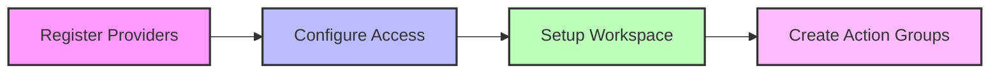
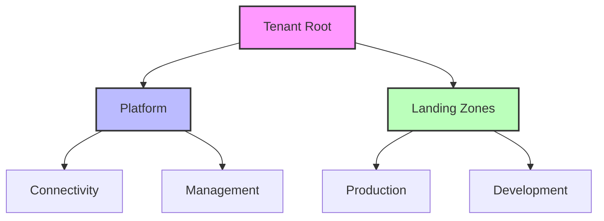

# Technical Implementation

## Deployment Process

### 1. Environment Preparation


#### Required Permissions
- Subscription Contributor
- Resource Group Owner
- Policy Contributor

### 2. Core Deployment

#### Azure CLI Deployment
```bash
# Set variables
resourceGroup="amba-monitoring-rg"
location="eastus"
workspaceName="amba-workspace"

# Create resource group
az group create --name $resourceGroup --location $location

# Deploy Log Analytics workspace
az monitor log-analytics workspace create \
    --resource-group $resourceGroup \
    --workspace-name $workspaceName \
    --location $location

# Deploy core initiatives
az policy set-definition create \
    --name "amba-monitoring-initiative" \
    --definitions "@policies/initiatives/monitoring.json"
```

#### PowerShell Deployment
```powershell
# Set variables
$resourceGroup = "amba-monitoring-rg"
$location = "eastus"
$workspaceName = "amba-workspace"

# Create resource group
New-AzResourceGroup -Name $resourceGroup -Location $location

# Deploy Log Analytics workspace
New-AzOperationalInsightsWorkspace `
    -ResourceGroupName $resourceGroup `
    -Name $workspaceName `
    -Location $location
```

## ALZ Integration

### Management Group Structure


### Integration Components
| Component | Purpose | Configuration |
|-----------|---------|---------------|
| Policy Initiatives | Monitoring standards | Management group level |
| Alert Rules | Resource monitoring | Subscription level |
| Action Groups | Alert notification | Resource group level |

## Policy Configuration

### Core Policy Initiatives
1. **Infrastructure Monitoring**
   - Network components
   - Storage services
   - Compute resources

2. **Security Monitoring**
   - Identity services
   - Key management
   - Compliance checks

3. **Application Monitoring**
   - Web services
   - API management
   - Database services

### Example Policy Definition
```json
{
  "name": "monitor-network-health",
  "properties": {
    "displayName": "Monitor Network Health",
    "description": "Monitors network components health",
    "metadata": {
      "category": "Monitoring"
    },
    "parameters": {
      "effect": {
        "type": "String",
        "defaultValue": "DeployIfNotExists"
      }
    },
    "policyRule": {
      "if": {
        "field": "type",
        "equals": "Microsoft.Network/virtualNetworks"
      },
      "then": {
        "effect": "[parameters('effect')]",
        "details": {
          "type": "Microsoft.Insights/metricAlerts",
          "deploymentScope": "subscription"
        }
      }
    }
  }
}
```

## Validation and Testing

### Deployment Validation
1. **Resource Deployment**
   - Verify resource creation
   - Check policy assignments
   - Validate permissions

2. **Alert Configuration**
   - Test alert triggers
   - Verify notifications
   - Check alert routing

3. **Integration Testing**
   - ALZ compatibility
   - Policy inheritance
   - Cross-subscription monitoring

### Common Issues and Solutions
| Issue | Solution |
|-------|----------|
| Policy Assignment Failures | Check permissions and scope |
| Alert Rule Conflicts | Review existing rules and deduplication |
| Resource Provider Errors | Verify provider registration |

## Next Steps

1. **Fine-tune Monitoring**
   - Adjust thresholds
   - Configure exclusions
   - Customize notifications

2. **Operational Setup**
   - Document configurations
   - Set up maintenance schedules
   - Train support teams

3. **Advanced Configuration**
   - Custom policy initiatives
   - Advanced alert rules
   - Integration with existing tools

[Previous: Overview](01-Overview.md) | [Next: Monitoring Configuration](03-Monitoring-Configuration.md) 