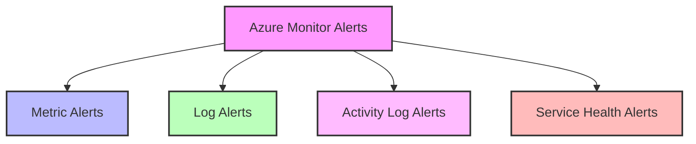
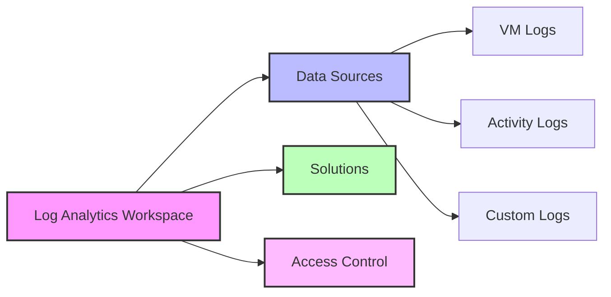

# Monitoring Configuration

## Alert Configuration

### Alert Types Overview


### Standard Alert Configurations

| Category | Metric | Threshold | Severity |
|----------|--------|-----------|----------|
| CPU Usage | Percentage | 90% | 1 - Critical |
| Memory | Available Bytes | 10% | 1 - Critical |
| Disk Space | Free Space | 10% | 2 - Warning |
| Network | Latency | 100ms | 2 - Warning |

### Alert Rule Example
```json
{
  "name": "High-CPU-Alert",
  "type": "Microsoft.Insights/metricAlerts",
  "properties": {
    "description": "Alert when CPU exceeds 90%",
    "severity": 1,
    "enabled": true,
    "scopes": ["<resourceId>"],
    "evaluationFrequency": "PT1M",
    "windowSize": "PT5M",
    "criteria": {
      "odata.type": "Microsoft.Azure.Monitor.SingleResourceMultipleMetricCriteria",
      "allOf": [
        {
          "name": "CPU",
          "metricName": "Percentage CPU",
          "operator": "GreaterThan",
          "threshold": 90,
          "timeAggregation": "Average"
        }
      ]
    }
  }
}
```

## Metric Configuration

### Core Metrics
1. **Infrastructure Metrics**
   - CPU utilization
   - Memory usage
   - Disk performance
   - Network throughput

2. **Application Metrics**
   - Response time
   - Request count
   - Error rate
   - Success rate

3. **Security Metrics**
   - Authentication attempts
   - Authorization failures
   - Resource access

### Custom Metrics
```json
{
  "customMetric": {
    "name": "AppTransactionRate",
    "unit": "Count",
    "dimensions": [
      {
        "name": "TransactionType",
        "value": ["Read", "Write", "Delete"]
      }
    ],
    "aggregation": {
      "type": "Total",
      "interval": "PT1M"
    }
  }
}
```

## Log Analytics Configuration

### Workspace Setup


### Data Collection Rules
| Source | Data Type | Collection Interval |
|--------|-----------|-------------------|
| VMs | Performance | 1 minute |
| Apps | Traces | Real-time |
| Platform | Activity | 5 minutes |
| Security | Audit | Real-time |

### Example KQL Queries
```kusto
// CPU Usage Above Threshold
Perf
| where ObjectName == "Processor"
| where CounterName == "% Processor Time"
| where CounterValue > 90
| summarize avg(CounterValue) by Computer, bin(TimeGenerated, 5m)

// Failed Authentication Attempts
SecurityEvent
| where EventID == 4625
| summarize count() by Account, bin(TimeGenerated, 1h)
```

## Action Groups

### Configuration Example
```json
{
  "name": "critical-alerts",
  "properties": {
    "groupShortName": "critical",
    "enabled": true,
    "emailReceivers": [
      {
        "name": "IT Team",
        "emailAddress": "it@contoso.com",
        "useCommonAlertSchema": true
      }
    ],
    "smsReceivers": [
      {
        "name": "On-Call",
        "countryCode": "1",
        "phoneNumber": "5555555555"
      }
    ]
  }
}
```

### Notification Matrix
| Severity | Email | SMS | Teams | Webhook |
|----------|-------|-----|-------|---------|
| Critical | Yes | Yes | Yes | Yes |
| Warning | Yes | No | Yes | Yes |
| Information | Yes | No | No | Yes |

## Best Practices

### Alert Management
1. **Alert Tuning**
   - Regular threshold reviews
   - False positive analysis
   - Alert correlation

2. **Notification Management**
   - Escalation paths
   - On-call rotations
   - Alert suppression rules

3. **Documentation**
   - Alert descriptions
   - Response procedures
   - Troubleshooting guides

### Performance Optimization
- Use appropriate collection intervals
- Implement data filtering
- Configure data retention
- Optimize log queries

## Next Steps

1. **Alert Refinement**
   - Review and adjust thresholds
   - Configure alert routing
   - Set up alert actions

2. **Monitoring Enhancement**
   - Add custom metrics
   - Create custom dashboards
   - Implement advanced queries

3. **Integration Setup**
   - Configure ITSM integration
   - Set up automation
   - Enable advanced analytics

[Previous: Technical Implementation](02-Technical-Implementation.md) | [Next: Management & Operations](04-Management-Operations.md) 