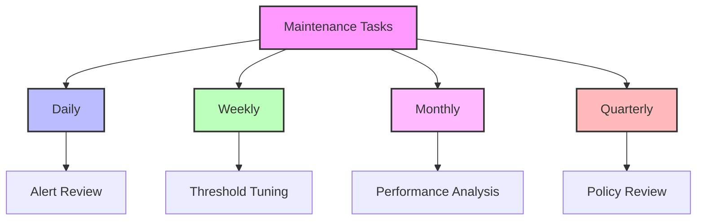
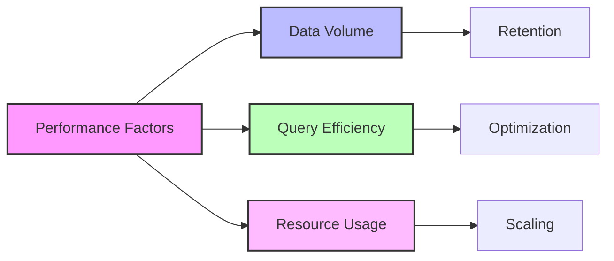
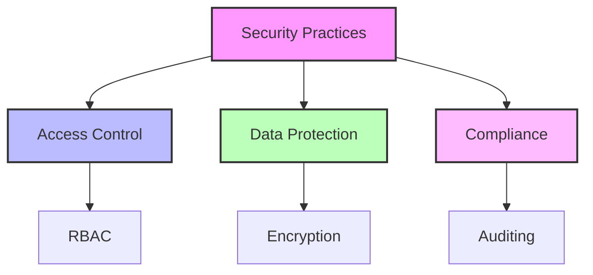

# Management & Operations

## Operational Tasks

### Regular Maintenance


### Maintenance Schedule
| Frequency | Task | Description |
|-----------|------|-------------|
| Daily | Alert Review | Check for critical alerts and false positives |
| Weekly | Threshold Tuning | Adjust alert thresholds based on patterns |
| Monthly | Performance Review | Analyze monitoring performance and costs |
| Quarterly | Policy Updates | Review and update monitoring policies |

## Troubleshooting Guide

### Common Issues

#### 1. Alert Configuration Issues
```json
{
  "problem": "Missing Alerts",
  "possibleCauses": [
    "Policy assignment failure",
    "Incorrect scope configuration",
    "Resource provider not registered"
  ],
  "solutions": [
    "Verify policy assignments",
    "Check resource scope",
    "Register required providers"
  ]
}
```

#### 2. Data Collection Issues
```json
{
  "problem": "Missing Data",
  "possibleCauses": [
    "Agent not installed",
    "Network connectivity",
    "Collection rules misconfigured"
  ],
  "solutions": [
    "Verify agent status",
    "Check network access",
    "Review collection rules"
  ]
}
```

### Resolution Steps
1. **Alert Issues**
   - Verify alert configuration
   - Check action group setup
   - Validate notification paths

2. **Policy Issues**
   - Review policy assignments
   - Check inheritance settings
   - Validate parameters

3. **Resource Issues**
   - Verify resource health
   - Check access permissions
   - Validate monitoring agent

## Performance Optimization

### Monitoring Performance


### Optimization Techniques
1. **Data Management**
   - Configure data retention
   - Implement data filtering
   - Optimize collection frequency

2. **Query Optimization**
   - Use efficient KQL
   - Implement query caching
   - Schedule heavy queries

3. **Resource Scaling**
   - Monitor workspace performance
   - Adjust capacity as needed
   - Optimize resource allocation

## Cost Management

### Cost Optimization
| Area | Strategy | Impact |
|------|----------|---------|
| Data Collection | Selective collection | Reduce ingestion costs |
| Data Retention | Tiered retention | Optimize storage costs |
| Query Usage | Query optimization | Reduce processing costs |

### Cost Control Measures
```json
{
  "costControl": {
    "dataIngestion": {
      "filtering": "Enable data filtering",
      "sampling": "Implement sampling for high-volume data",
      "retention": "Set appropriate retention periods"
    },
    "monitoring": {
      "scope": "Target critical resources",
      "frequency": "Optimize collection intervals",
      "storage": "Use appropriate storage tiers"
    }
  }
}
```

## Security Management

### Security Controls
1. **Access Management**
   - Role-based access
   - Just-in-time access
   - Privileged identity management

2. **Data Protection**
   - Encryption at rest
   - Encryption in transit
   - Key management

3. **Compliance**
   - Audit logging
   - Policy compliance
   - Regular reviews

### Security Best Practices


## Documentation & Training

### Documentation Requirements
1. **Operational Procedures**
   - Alert response
   - Maintenance tasks
   - Troubleshooting steps

2. **Configuration Details**
   - Policy settings
   - Alert rules
   - Action groups

3. **Change Management**
   - Change procedures
   - Approval processes
   - Rollback plans

### Training Materials
- Alert handling procedures
- Troubleshooting guides
- Tool usage documentation
- Best practices guides

## Next Steps

1. **Operational Excellence**
   - Implement automation
   - Enhance documentation
   - Regular team training

2. **Continuous Improvement**
   - Monitor effectiveness
   - Gather feedback
   - Update procedures

3. **Advanced Features**
   - Custom solutions
   - Integration options
   - Advanced analytics

[Previous: Monitoring Configuration](03-Monitoring-Configuration.md) | [Next: Advanced Topics](05-Advanced-Topics.md) 