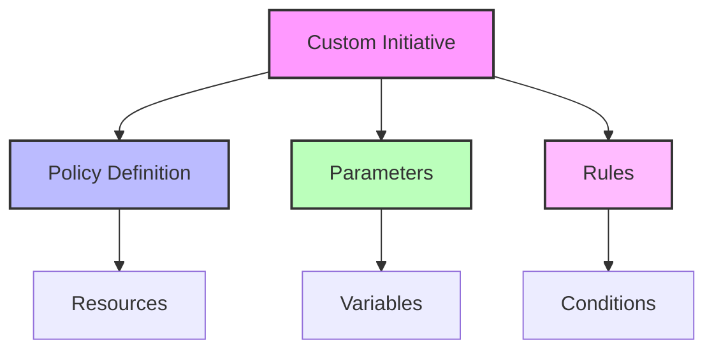
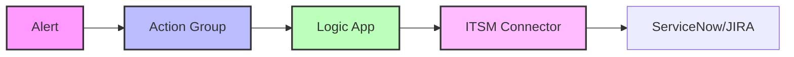

# Advanced Topics

## Custom Initiatives

### Creating Custom Initiatives


### Example Custom Initiative
```json
{
  "properties": {
    "displayName": "Custom Monitoring Initiative",
    "description": "Custom monitoring rules for specific workloads",
    "metadata": {
      "category": "Monitoring",
      "version": "1.0.0"
    },
    "parameters": {
      "effect": {
        "type": "String",
        "allowedValues": [
          "DeployIfNotExists",
          "Disabled"
        ],
        "defaultValue": "DeployIfNotExists"
      },
      "workspaceId": {
        "type": "String",
        "metadata": {
          "displayName": "Log Analytics Workspace"
        }
      }
    },
    "policyDefinitions": [
      {
        "policyDefinitionId": "/providers/Microsoft.Authorization/policyDefinitions/custom-monitoring",
        "parameters": {
          "effect": {
            "value": "[parameters('effect')]"
          },
          "workspaceId": {
            "value": "[parameters('workspaceId')]"
          }
        }
      }
    ]
  }
}
```

## Advanced Configurations

### Complex Alert Rules
```json
{
  "name": "Complex-Metric-Alert",
  "properties": {
    "description": "Advanced metric alert with multiple conditions",
    "severity": 1,
    "enabled": true,
    "scopes": ["<resourceId>"],
    "evaluationFrequency": "PT1M",
    "windowSize": "PT5M",
    "criteria": {
      "odata.type": "Microsoft.Azure.Monitor.MultipleResourceMultipleMetricCriteria",
      "allOf": [
        {
          "criterionType": "DynamicThresholdCriterion",
          "name": "CPU",
          "metricName": "Percentage CPU",
          "operator": "GreaterThan",
          "alertSensitivity": "Medium",
          "failingPeriods": {
            "numberOfEvaluationPeriods": 4,
            "minFailingPeriodsToAlert": 3
          },
          "timeAggregation": "Average"
        },
        {
          "criterionType": "StaticThresholdCriterion",
          "name": "Memory",
          "metricName": "Available Memory Bytes",
          "operator": "LessThan",
          "threshold": 1073741824,
          "timeAggregation": "Average"
        }
      ]
    },
    "autoMitigate": true,
    "actions": [
      {
        "actionGroupId": "<actionGroupId>",
        "webhookProperties": {
          "incidentId": "[variables('incidentId')]",
          "severity": "Critical"
        }
      }
    ]
  }
}
```

### Advanced KQL Queries
```kusto
// Complex Performance Analysis
let timeRange = 1h;
let threshold = 90;
Perf
| where TimeGenerated > ago(timeRange)
| where ObjectName == "Processor" and CounterName == "% Processor Time"
| summarize 
    avgCPU = avg(CounterValue),
    maxCPU = max(CounterValue),
    minCPU = min(CounterValue),
    stdDevCPU = stdev(CounterValue)
    by Computer, bin(TimeGenerated, 5m)
| where avgCPU > threshold
| join kind=inner (
    Perf
    | where TimeGenerated > ago(timeRange)
    | where ObjectName == "Memory" and CounterName == "% Committed Bytes In Use"
    | summarize avgMemory = avg(CounterValue) by Computer, bin(TimeGenerated, 5m)
) on Computer, TimeGenerated
| project
    TimeGenerated,
    Computer,
    avgCPU,
    maxCPU,
    minCPU,
    stdDevCPU,
    avgMemory
| order by avgCPU desc
```

## Integration Patterns

### ITSM Integration


### Example Logic App Workflow
```json
{
  "definition": {
    "triggers": {
      "manual": {
        "type": "Request",
        "kind": "Http"
      }
    },
    "actions": {
      "Create_ITSM_Ticket": {
        "type": "ServiceNow",
        "inputs": {
          "method": "POST",
          "uri": "https://instance.service-now.com/api/now/table/incident",
          "headers": {
            "Content-Type": "application/json"
          },
          "body": {
            "short_description": "@triggerBody()?['alertName']",
            "description": "@triggerBody()?['description']",
            "severity": "@triggerBody()?['severity']",
            "category": "monitoring"
          }
        }
      }
    }
  }
}
```

## Advanced Analytics

### Machine Learning Integration
1. **Anomaly Detection**
   ```python
   from azure.ai.anomalydetector import AnomalyDetectorClient
   from azure.ai.anomalydetector.models import DetectRequest, TimeSeriesPoint
   
   def detect_anomalies(time_series_data):
       client = AnomalyDetectorClient(endpoint, credential)
       series = [TimeSeriesPoint(timestamp=p['timestamp'], value=p['value']) 
                for p in time_series_data]
       request = DetectRequest(series=series, granularity='hourly')
       response = client.detect_entire_series(request)
       return response.is_anomaly
   ```

2. **Predictive Analytics**
   ```python
   from azure.ai.textanalytics import TextAnalyticsClient
   
   def analyze_alert_patterns(alert_data):
       client = TextAnalyticsClient(endpoint, credential)
       documents = [alert['description'] for alert in alert_data]
       response = client.extract_key_phrases(documents)
       return [doc.key_phrases for doc in response]
   ```

### Advanced Visualizations

#### Custom Workbook Template
```json
{
  "version": "Notebook/1.0",
  "items": [
    {
      "type": "query",
      "queryType": 0,
      "resourceType": "microsoft.operationalinsights/workspaces",
      "query": "let timeRange = {timeRange};\nlet threshold = {threshold};\nPerf\n| where TimeGenerated > ago(timeRange)\n| where ObjectName == \"Processor\"\n| summarize avgCPU = avg(CounterValue) by Computer, bin(TimeGenerated, 5m)\n| render timechart"
    },
    {
      "type": "metric",
      "metrics": [
        {
          "resourceMetadata": {
            "id": "{resourceId}"
          },
          "name": "Percentage CPU",
          "aggregationType": 4,
          "namespace": "microsoft.compute/virtualmachines",
          "metricVisualization": {
            "displayName": "CPU Usage"
          }
        }
      ],
      "visualization": {
        "chartType": 2,
        "legendVisualization": {
          "isVisible": true,
          "position": 2,
          "hideSubtitle": false
        },
        "axisVisualization": {
          "x": {
            "isVisible": true,
            "axisType": 2
          },
          "y": {
            "isVisible": true,
            "axisType": 1
          }
        }
      }
    }
  ]
}
```

## Automation & DevOps

### Infrastructure as Code
```yaml
# Azure Pipeline for AMBA Deployment
trigger:
  - main

variables:
  resourceGroup: 'amba-monitoring-rg'
  location: 'eastus'

stages:
  - stage: Deploy
    jobs:
      - job: DeployAMBA
        steps:
          - task: AzurePowerShell@5
            inputs:
              azureSubscription: 'Azure Subscription'
              ScriptType: 'InlineScript'
              Inline: |
                # Deploy AMBA resources
                New-AzResourceGroup -Name $(resourceGroup) -Location $(location)
                
                # Deploy monitoring components
                New-AzDeployment -Name "amba-deployment" `
                  -TemplateFile "templates/monitoring.json" `
                  -TemplateParameterFile "parameters/monitoring.parameters.json"
```

### Automated Testing
```powershell
# Test AMBA deployment
Describe "AMBA Deployment Tests" {
    Context "Resource Deployment" {
        It "Should have created Log Analytics workspace" {
            $workspace = Get-AzOperationalInsightsWorkspace -ResourceGroupName $resourceGroup
            $workspace | Should -Not -BeNullOrEmpty
        }
        
        It "Should have deployed policy initiatives" {
            $initiatives = Get-AzPolicySetDefinition | Where-Object { $_.Properties.DisplayName -like "AMBA*" }
            $initiatives | Should -Not -BeNullOrEmpty
        }
    }
}
```

## Next Steps

1. **Advanced Implementation**
   - Custom initiative development
   - Advanced alert patterns
   - ML integration

2. **Integration Development**
   - ITSM system integration
   - Custom dashboards
   - Automated remediation

3. **Optimization**
   - Performance tuning
   - Cost optimization
   - Advanced analytics

[Previous: Management & Operations](04-Management-Operations.md) | [Back to Overview](01-Overview.md) 